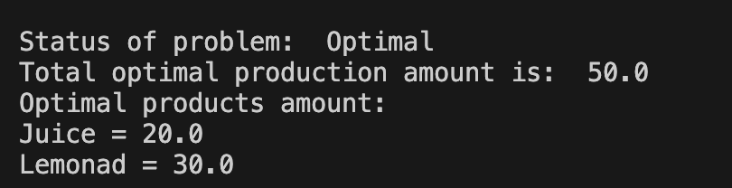
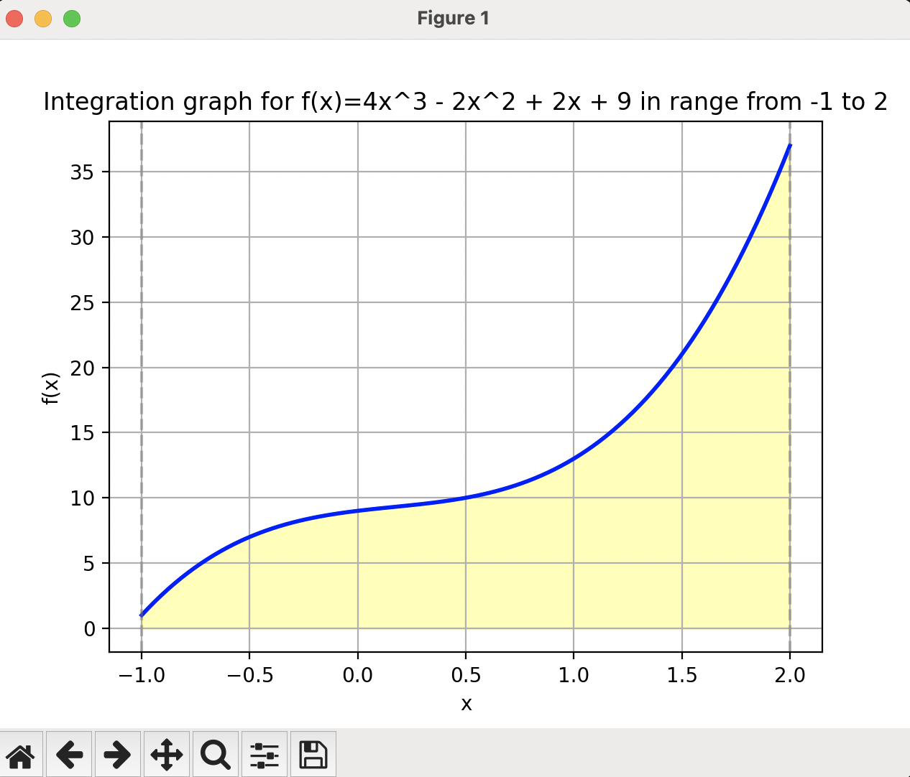
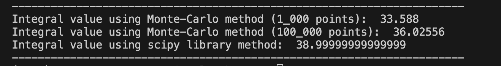
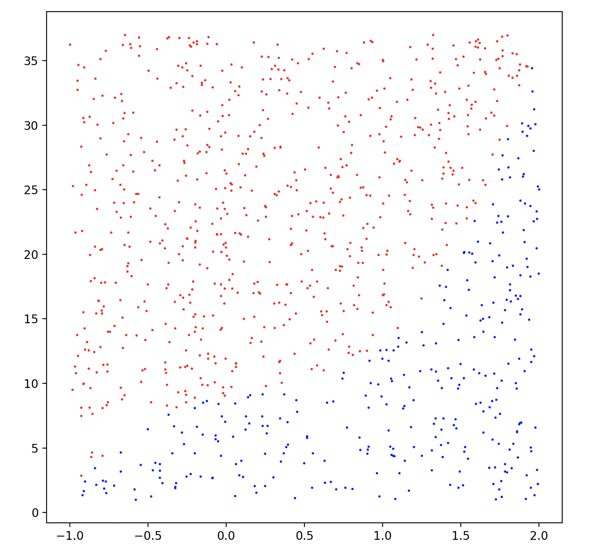
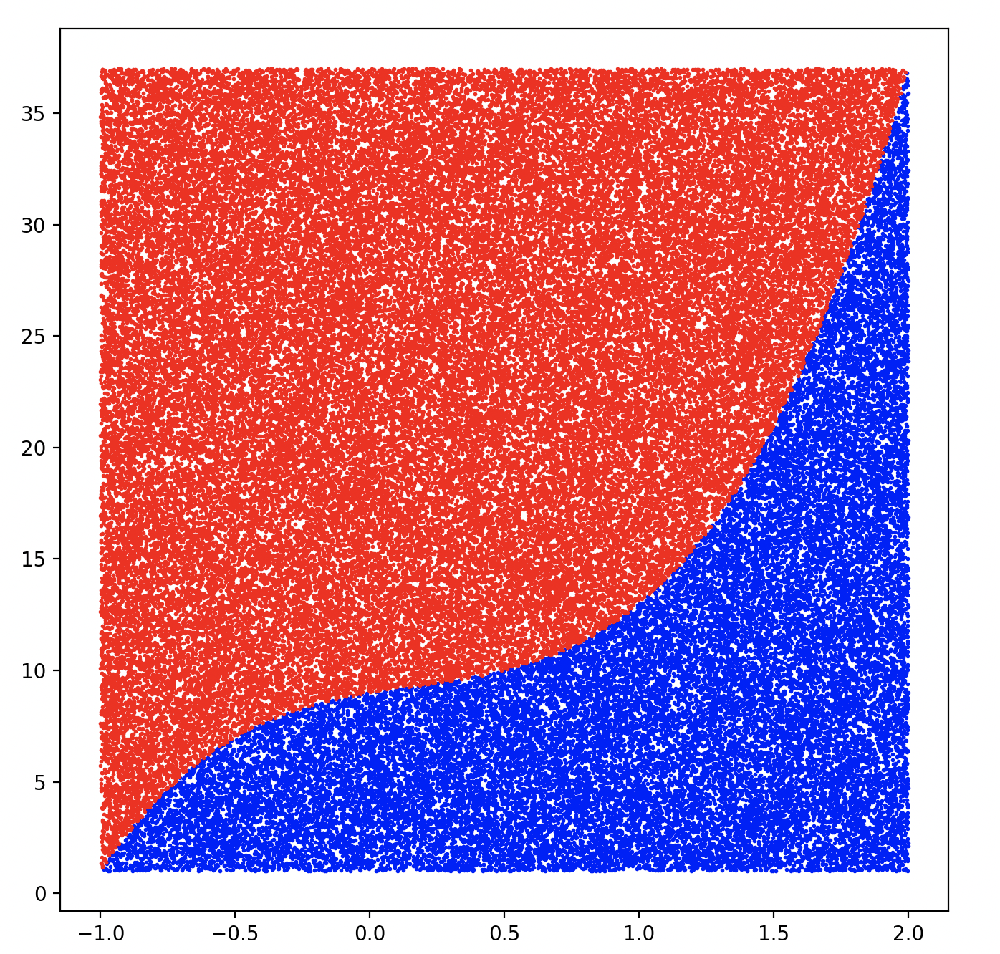

# goit-algo-hw-10
Production optimisation problem solving with the help of linear programming technique. Integral function value calculation using Monte-Carlo method, which is based on randomised algorithm.

# Task 1.
Solving of the production optimisation task with the help of linear programming gives us the next results.

The optimal total max production amount is 50 units, that consists of 30 units of lemonad and 20 units of fruit juice.

# Task 2.
To find integral value of the function f(x)=4x^3 - 2x^2 + 2x + 9 means to calculate an area of the next complex figure bounded by the given function curve.

We can calculate an area of the given complex geometric figure using Monte-Carlo method, that is based on the randomised algorithm. We can compare obtained result for 1000 and 1000000 points with analitical result calculated with the help of scipy library methods.

As we can see Monte-Carlo method gives us quit accurate result. Moreover it's accuracy increases with the number of points and experiments. 
We can visualize Monte-Carlo method for given task solving for 1_000 points:

And for 100_000 points:

